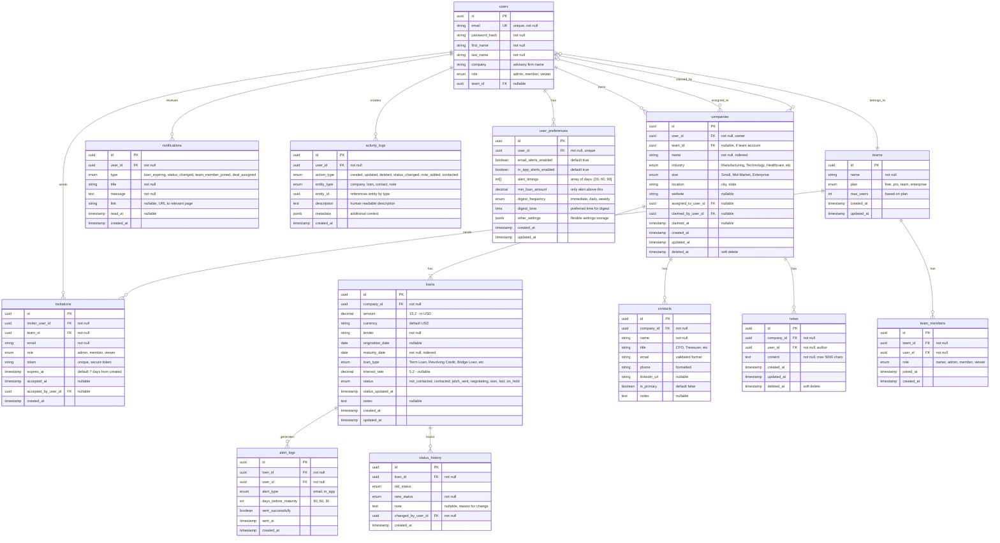

# Loan-Beacon

# LoanBeacon 🏦

> Illuminate refinancing opportunities before your competition does.

**LoanBeacon** helps debt advisors track loan maturity dates and identify refinancing opportunities 3-6 months in advance, giving you the competitive edge to win more deals.

## 🎯 Why LoanBeacon?

In the competitive world of debt advisory, **timing is everything**. Companies refinancing their loans need advisors, but by the time most advisors know about it, the opportunity is gone.

**LoanBeacon changes that.**

- 🔍 **Track loan maturity dates** across your target companies
- 🔔 **Get alerted** 3-6 months before refinancing deadlines
- 📊 **Prioritize opportunities** by loan size and urgency
- 🏃 **Reach out first** and win more deals

---

## ✨ Features

### Current (MVP - v0.1)

- 🏢 **Company Database** - Comprehensive company and loan data management
- 📅 **Maturity Tracking** - Visual timeline of upcoming loan maturities
- 🔔 **Smart Alerts** - Automated notifications for approaching deadlines
- 🔍 **Advanced Search** - Filter by industry, size, maturity date, loan amount
- 👥 **Team Access** - Multi-user support for advisory firms
- 📊 **Pipeline Dashboard** - See your opportunity pipeline at a glance
- 🔐 **Secure Login** - Role-based access control

### Coming Soon

- 📧 **Outreach Templates** - Pre-built email campaigns
- 📱 **Mobile App** - Access on the go
- 🤖 **Auto Data Collection** - Scrape public filings automatically
- 📈 **Deal Analytics** - Track conversion rates and ROI
- 🔗 **CRM Integration** - Sync with Salesforce, HubSpot, etc.

---

## 🚀 Quick Start

## 📊 MVP Requirements Checklist

### 🎯 MUST Have (Launch Blockers)

[ ] **Loan Maturity Database** - PostgreSQL schema with companies and loans
[ ] **Company Profiles** - CRUD operations for company data
[ ] **Timeline Tracking** - Visual calendar of maturity dates
[ ] **Lead Alerts** - Email notifications for approaching deadlines
[ ] **Search & Filter** - Advanced query functionality
[ ] **User Authentication** - JWT-based auth system
[ ] **Data Entry Interface** - Form for manual loan data input _(In Progress)_

### ✅ SHOULD Have (High Priority)

- [ ] **CRM Export** - CSV/Excel export for Salesforce, HubSpot
- [ ] **Lead Prioritization** - Scoring algorithm based on loan size/urgency
- [ ] **Multi-User Support** - Team accounts for advisory firms
- [ ] **Reporting Dashboard** - Charts showing pipeline metrics
- [ ] **Contact Management** - Store decision-maker information
- [ ] **Competitor Flags** - Mark deals being pursued by others

### 💡 COULD Have (Nice to Have)

- [ ] **Automated Data Scraping** - Pull from SEC filings, company websites
- [ ] **Email Templates** - Pre-written outreach messages
- [ ] **Deal Tracking** - Win/loss tracking and analytics
- [ ] **Industry Benchmarks** - Average loan terms by sector
- [ ] **Mobile App** - React Native iOS/Android app
- [ ] **Advanced Analytics** - Conversion rates, best outreach timing

### ❌ WON'T Have (Out of Scope for MVP)

- Full CRM replacement functionality
- Built-in email sending capabilities
- Payment processing system
- Loan structuring calculator tools
- Multi-language internationalization
- Public API for third-party access

---

## 🗺 Roadmap

### Q1 2024: MVP Launch ✅

- [x] Core database and backend API
- [x] Authentication system
- [x] Basic dashboard UI
- [ ] Manual data entry
- [ ] Alert notifications

### Q2 2024: Enhancement

- [ ] CRM integrations (Salesforce, HubSpot)
- [ ] Advanced search filters
- [ ] Team collaboration features
- [ ] Email templates library
- [ ] Mobile-responsive design improvements

### Q3 2024: Automation

- [ ] Automated data collection from public sources
- [ ] AI-powered lead scoring
- [ ] Automated email sequences
- [ ] Advanced analytics dashboard
- [ ] Deal pipeline management

### Q4 2024: Scale & Enterprise

- [ ] Native mobile apps (iOS/Android)
- [ ] Enterprise SSO integration
- [ ] White-label options
- [ ] API for partners
- [ ] Advanced reporting and BI tools

---

